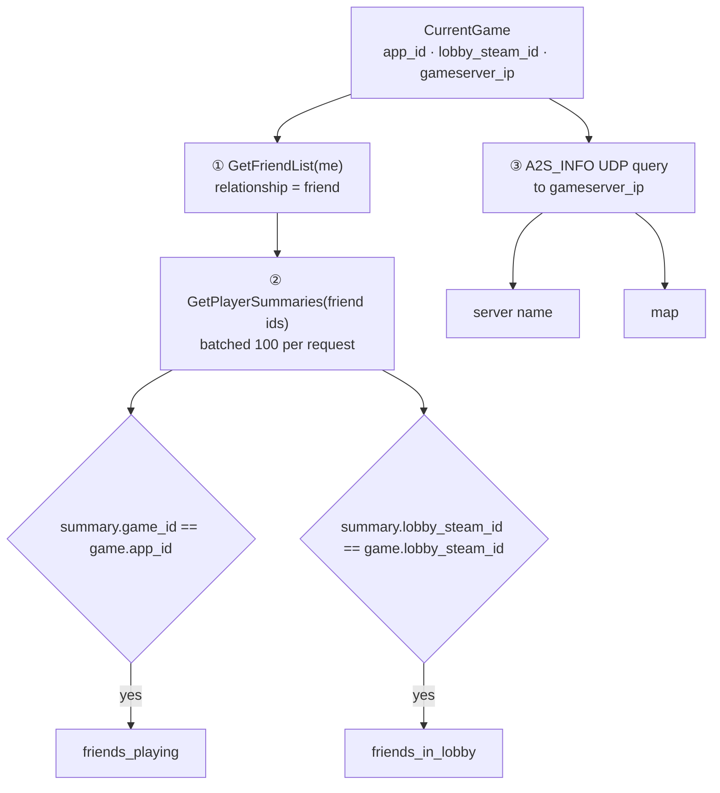
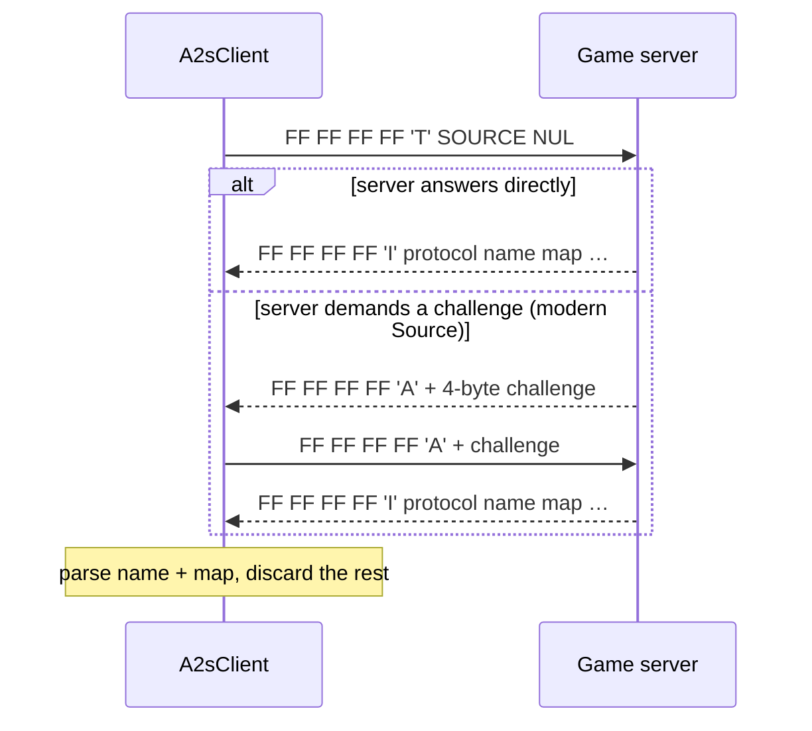

# Enrichment pipeline

<SourceLink path="src/enrich.rs" lines={190} /> <SourceLink path="src/a2s.rs" lines={331} />

Enrichment is everything beyond "which game, from when to when". It runs on
every tick while a session is open and `enrich = true`, and it is wholly
best-effort: [`enrich::analyze`](../reference/enrich.mdx#analyze) returns an
`Enrichment` value, never an error.

## The three sources



```rust title="src/enrich.rs"
pub fn analyze(client: &SteamClient, a2s: &mut A2sClient, me: u64, game: &CurrentGame) -> Enrichment {
    let Ok(friends) = client.friends(me) else { return Enrichment::default(); };
    let ids: Vec<u64> = friends.iter().map(|f| f.steam_id).collect();
    let Ok(summaries) = client.summaries(&ids) else { return Enrichment::default(); };
    let (server, map) = server_and_map(a2s, game);
    build(&summaries, game, map, server)
}
```

Note the ordering: if the friend list or the batch summaries call fails,
`analyze` returns **completely empty** enrichment — including server and map,
which would otherwise have been available. That is a deliberate simplification,
not an oversight; the next tick tries again.

## ① and ② — friends playing the same game {/* #friends-same-game */}

`GetFriendList` returns SteamIDs only, so a second call
(`GetPlayerSummaries`, chunked at Steam's 100-ID limit) resolves names and
current activity. Matching is a single comparison:

```rust
summaries.iter().filter(|s| s.game_id == Some(game.app_id))
```

- Compared on **AppID**, not title, so localisation and `gameextrainfo`
  differences do not matter.
- Results are **sorted and de-duplicated** by persona name — two friends with
  the same display name collapse into one entry.
- Only your friends are considered; the tracked account is never in its own
  friend list, so you never appear in your own `friends_playing`.
- A friend whose profile hides game details simply has no `gameid` and is
  invisible here.

## ② — friends in the same lobby {/* #friends-same-lobby */}

```rust
let Some(lobby) = game.lobby_steam_id.as_deref() else { return Vec::new(); };
summaries.iter().filter(|s| s.lobby_steam_id.as_deref() == Some(lobby))
```

The lobby is identified by the opaque `lobbysteamid` string Steam reports for
both you and your friends. Exact string equality means "the same Steam lobby".

:::info Why the field is often missing
`lobbysteamid` is only reported for games that use **Steam lobbies** (P2P
matchmaking, party systems built on `ISteamMatchmaking`). Games with their own
matchmaking (most dedicated-server shooters) never expose it, and the field is
simply omitted from the log. There is no fallback heuristic — "same server" is
not treated as "same lobby".
:::

Note that `friends_in_lobby` is not filtered by game: in practice a shared
lobby ID implies the same game, so the extra check is unnecessary.

## ③ — server name and current map {/* #server-and-map */}

If Steam reports a `gameserverip` (`ip:port`), SteamLogger sends an
[A2S_INFO](https://developer.valvesoftware.com/wiki/Server_queries) query
straight to that address over UDP — no Steam involvement:



Only the first two strings of the reply — server name and map — are kept;
everything after them is ignored. Timeout is 3 seconds, and any failure
(timeout, ICMP unreachable, malformed packet, repeated challenge) yields
`(None, None)` so the entry keeps its other fields.

Protocol specifics, byte layouts and two known deviations from Valve's spec are
documented in the [`a2s` reference](../reference/a2s.mdx).

## Assembly

```rust
Enrichment {
    map,
    server,
    friends_playing: same_game_friends(summaries, game),
    friends_in_lobby: lobby_friends(summaries, game),
}
```

`main` then calls
[`Tracker::apply_meta`](../reference/tracker.mdx#apply_meta), which stores
empty vectors as `None` so that empty arrays never reach the JSON.

## What enrichment costs

| | Requests per tick | Bandwidth | Fails how? |
| --- | --- | --- | --- |
| `GetFriendList` | 1 HTTPS | small | aborts the whole enrichment pass |
| `GetPlayerSummaries` (friends) | `ceil(n/100)` HTTPS | ~1 KB per friend | aborts the whole enrichment pass |
| A2S_INFO | 1–2 UDP datagrams | &lt; 2 KB | only `server`/`map` are lost |

Setting `enrich = false` removes all of it: one Steam call per tick, zero UDP,
and only `name`/`start`/`end` in the log.

## Limits worth repeating

- **Snapshot, not timeline.** Fields describe the latest poll, not the whole
  session. A friend who played for ten minutes and left is only recorded if a
  poll happened while they were in-game, and is dropped from the entry on the
  next successful enrichment pass.
- **Names, not IDs.** The log stores persona names, which users can change at
  any time. There is no stable identifier in the output format.
- **Private profiles are invisible**, both yours (nothing is logged at all) and
  your friends' (they never appear in `friends_playing`).
- **No retries inside a tick.** Every source gets exactly one attempt per poll.

## Related

- [`steamlogger::enrich`](../reference/enrich.mdx) — function-level reference.
- [`steamlogger::a2s`](../reference/a2s.mdx) — the UDP protocol implementation.
- [`steamlogger::steam::api`](../reference/steam-api.mdx) — endpoints, raw
  payload shapes, parsers.
- [Resilience](./resilience.mdx) — the complete failure matrix.
