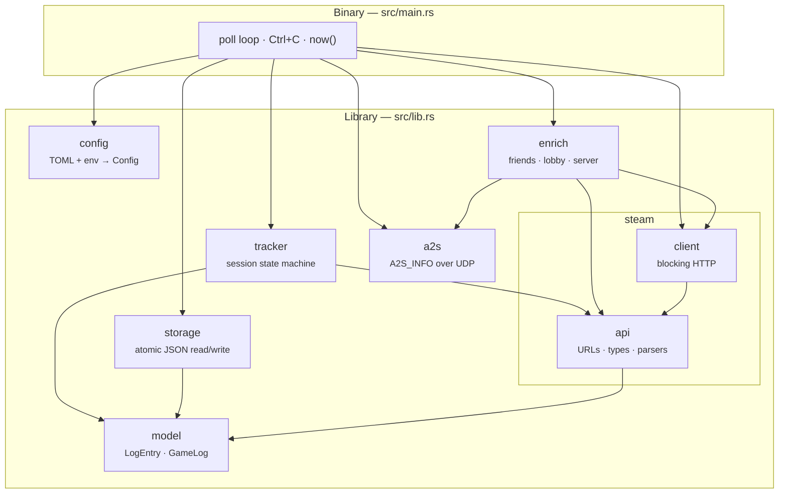

# Architecture overview

SteamLogger is deliberately small: about 800 lines of library code (plus ~960
lines of tests living beside it) and a 98-line binary — no async runtime, no
threads other than the one the `ctrlc` crate installs, and no state outside one
in-memory `GameLog` and one file on disk.

## The shape of the program



Every arrow is a compile-time dependency. The graph is acyclic and shallow:
`model` depends on nothing, `api` only on `model`, and the binary is the only
place where HTTP, UDP, the clock and the filesystem meet.

## Module responsibilities

| Module | Lines (incl. tests) | Owns | Never does |
| --- | --- | --- | --- |
| [`main`](../reference/main.mdx) | 98 | Process lifecycle: arg parsing, poll loop, signal handling, wall-clock timestamps | Parse JSON, build URLs |
| [`config`](../reference/config.mdx) | 263 | Loading, env overrides, validation of `Config` | Touch the network |
| [`model`](../reference/model.mdx) | 40 | `LogEntry` / `GameLog` serde types | Any logic |
| [`tracker`](../reference/tracker.mdx) | 259 | The session state machine and the in-memory log | I/O of any kind |
| [`enrich`](../reference/enrich.mdx) | 190 | Turning friend summaries + A2S replies into optional fields | Fail — it degrades instead |
| [`storage`](../reference/storage.mdx) | 210 | Reading and atomically writing the log file | Know about Steam |
| [`a2s`](../reference/a2s.mdx) | 331 | The A2S_INFO UDP protocol | Know about sessions |
| [`steam::api`](../reference/steam-api.mdx) | 334 | URL builders, raw↔domain types, pure parsers | Perform requests |
| [`steam::client`](../reference/steam-client.mdx) | 125 | Blocking HTTP, chunking, error context | Interpret payloads |

## Design rules the code follows

### 1. Pure core, thin I/O shell

Parsing (`steam::api`), state transitions (`tracker`) and matching (`enrich`)
are plain functions over plain data. They are unit-tested without a network,
a clock or a filesystem. Only `steam::client`, `a2s`, `storage` and `main`
perform I/O, and each of them is a thin wrapper.

This is why `now()` lives in `main` and timestamps are passed *into*
`Tracker::update(&game, now)` as a string: the state machine has no clock to
mock.

### 2. Enrichment is optional, everywhere

`LogEntry` models every enrichment field as `Option`, `enrich::analyze` returns
`Enrichment::default()` instead of an error, and
`Tracker::apply_meta` stores empty vectors as `None`. A degraded tick produces
a smaller entry, never a failed run. See
[Resilience](./resilience.mdx).

### 3. One writer, whole-file writes

There is no append path and no partial update. The in-memory `GameLog` is the
source of truth during a run; `storage::write_log` serialises all of it, every
tick, through a temp file and a rename. Simple, atomic, and bounded by how big
your history gets.

### 4. Blocking, single-threaded, zero scheduling

`reqwest`'s blocking client and a `std::sync::mpsc` receiver with
`recv_timeout` replace an async runtime: the loop sleeps on the channel, and
<kbd>Ctrl</kbd>+<kbd>C</kbd> wakes it instantly. The only extra thread is the
signal handler installed by `ctrlc`.

### 5. The library is usable on its own

`src/lib.rs` re-exports all seven modules, so the crate can be consumed
programmatically — see [Library usage](../guides/library-usage.mdx). The binary
is just the default wiring of those parts.

## Data flow in one pass

```mermaid
sequenceDiagram
    autonumber
    participant Loop as main::run
    participant Client as steam::client::SteamClient
    participant Api as steam::api
    participant Track as tracker::Tracker
    participant Enr as enrich
    participant A2s as a2s::A2sClient
    participant Store as storage

    Loop->>Client: current_game(steam_id)
    Client->>Api: player_summaries_url(key, [id])
    Client->>Client: HTTP GET (blocking, 10 s timeout)
    Client->>Api: parse_player_summaries(body)
    Api->>Api: summary_to_current_game(row)
    Client-->>Loop: Option of CurrentGame

    alt in game
        Loop->>Track: update(&game, now)
        Track-->>Loop: Started(i) | Running(i)
        opt enrich enabled
            Loop->>Enr: analyze(client, a2s, me, game)
            Enr->>Client: friends(me) → list of Friend
            Enr->>Client: summaries(ids) → list of PlayerSummary
            Enr->>A2s: query(gameserver_ip)
            A2s-->>Enr: ServerInfo { name, map }
            Enr-->>Loop: Enrichment
            Loop->>Track: apply_meta(i, map, server, friends…)
        end
    else not in game
        Loop->>Track: end_active(now)
    end

    Loop->>Store: write_log(path, tracker.log())
    Store->>Store: write *.tmp → rename
```

## Where state lives

| State | Lifetime | Owner |
| --- | --- | --- |
| `Config` | whole process, immutable after load | `main::run` |
| `GameLog` (all entries) | whole process, mutated each tick | `Tracker` |
| `active_index` | whole process | `Tracker` |
| HTTP connection pool | whole process | `SteamClient` (reqwest) |
| UDP socket | one per A2S query | `A2sClient::query` |
| The log file | forever | disk |

`A2sClient` holds only a timeout; it binds a fresh ephemeral UDP socket per
query and drops it afterwards.

## Keep reading

- [The poll loop](./poll-loop.mdx) — what one tick does, in order, with costs.
- [Session lifecycle](./session-lifecycle.mdx) — the state machine and resume
  semantics.
- [Enrichment pipeline](./enrichment-pipeline.mdx) — the three enrichment
  sources and their matching rules.
- [Resilience](./resilience.mdx) — every failure mode and what it degrades to.
- [Code reference](../reference/index.mdx) — item-by-item API documentation.
