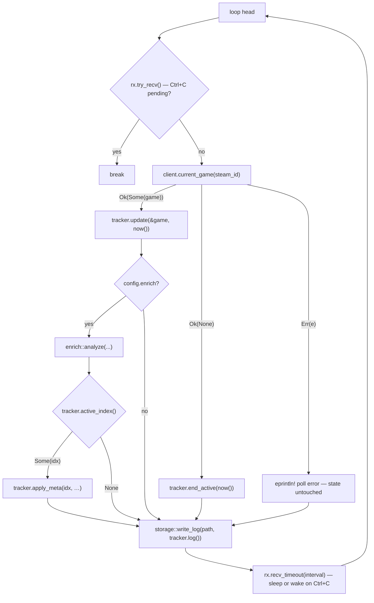

# The poll loop

<SourceLink path="src/main.rs" lines={98} />

Everything SteamLogger does at runtime happens inside one `loop` in
[`main::run`](../reference/main.mdx#run). This page walks through it in
execution order.

## Startup

```rust title="src/main.rs (abridged)"
let client   = SteamClient::new(config.api_key.clone());
let mut a2s  = A2sClient::new();
let mut tracker = Tracker::new(storage::read_log(&config.output_file).unwrap_or_default());
let interval = Duration::from_secs(config.poll_interval_secs.max(5));

let (tx, rx) = mpsc::channel::<()>();
ctrlc::set_handler(move || { let _ = tx.send(()); })?;
println!("SteamLogger running. Log file: {}  (Ctrl+C to stop)", config.output_file.display());
```

| Step | Detail |
| --- | --- |
| Build `SteamClient` | 10-second HTTP timeout, `User-Agent: SteamLogger/0.1 (github.com/steamlogger)`, connection pool reused for the whole run. |
| Build `A2sClient` | 3-second UDP read timeout; no socket is created yet. |
| Load existing log | `read_log(...).unwrap_or_default()` — an unreadable or malformed file yields an **empty** log ([consequence](./resilience.mdx#startup-read-failures-are-swallowed)). |
| Build `Tracker` | Inspects the last entry: `end: null` means "resume", otherwise "idle". |
| Clamp the interval | `poll_interval_secs.max(5)` — the effective floor is 5 seconds. |
| Install the signal handler | A `SIGINT` handler sends `()` down an `mpsc` channel. Failure to install is fatal (exit code `1`). |

## One tick



### 1. Check for shutdown

`rx.try_recv()` is non-blocking. If <kbd>Ctrl</kbd>+<kbd>C</kbd> arrived during
the previous tick's work, the loop breaks before making another network call.

### 2. Ask Steam what is running

`client.current_game(config.steam_id)` performs one `GetPlayerSummaries`
request for a single SteamID and maps the row through
[`summary_to_current_game`](../reference/steam-api.mdx#summary_to_current_game):

- `Ok(Some(game))` → in game.
- `Ok(None)` → the profile reports no `gameid` (not playing, or game details
  are not public).
- `Err(e)` → network/HTTP/JSON failure. Printed as `poll error: …`; **the
  tracker is not touched**, so an outage never fabricates a session end.

### 3. Update the state machine

`tracker.update(&game, &now())` returns `Started(i)` or `Running(i)` and
handles game switches; `tracker.end_active(&now())` closes an open session.
Full rules in [Session lifecycle](./session-lifecycle.mdx).

The timestamp is computed in `main` (`now()`), not inside the tracker, so the
state machine stays pure and testable.

### 4. Enrich (optional)

When `enrich = true` and a session is active, `enrich::analyze` collects
friends, lobby members, server name and map, then `tracker.apply_meta` writes
them onto the active entry. `analyze` never returns an error — a failure just
produces empty data. Only `apply_meta` can fail (index out of bounds), which is
reported as `enrichment failed: …`.

### 5. Persist

`storage::write_log(&config.output_file, tracker.log())` serialises the whole
log and renames it into place. A write failure prints `failed to save log: …`
and the loop continues — the in-memory log is still correct and the next tick
retries.

### 6. Sleep — interruptibly

```rust
let _ = rx.recv_timeout(interval);
```

The loop blocks on the channel rather than `thread::sleep`, so
<kbd>Ctrl</kbd>+<kbd>C</kbd> ends the wait immediately instead of after up to
`poll_interval_secs`. The received value (if any) is discarded here; the
`try_recv` at the top of the next iteration is what actually breaks the loop.

## Shutdown

```rust
if let Err(e) = storage::write_log(&config.output_file, &tracker.into_log()) {
    eprintln!("failed to save log: {e}");
}
println!("stopped");
ExitCode::SUCCESS
```

`into_log()` consumes the tracker and hands over the `GameLog` for one last
write. Note what shutdown deliberately does **not** do: it never calls
`end_active`. A session running at shutdown stays open so the next run can
resume it.

## Cost per tick

| Operation | Count | Notes |
| --- | --- | --- |
| `GetPlayerSummaries` (self) | 1 | Always. |
| `GetFriendList` | 1 | Only when `enrich = true` and you are in a game. |
| `GetPlayerSummaries` (friends) | `ceil(friends / 100)` | Steam caps 100 SteamIDs per request; `SteamClient::summaries` chunks automatically. |
| A2S_INFO UDP round trip | 0–2 packets | Only when Steam reports a `gameserverip`; a challenge reply costs one extra exchange. |
| Log file rewrite | 1 | Whole file, pretty-printed. |

With the default 30-second interval, 200 friends and a game running all day,
that is roughly `2 880 × (1 + 1 + 2) ≈ 11 520` Steam API calls per day —
comfortably under Steam's 100 000/day courtesy limit, but worth keeping in mind
if you lower the interval. Idle time is cheaper: one call per tick.

## Timing characteristics

- The interval is the **gap between ticks**, not a fixed period: the sleep
  starts *after* the work finishes, so a slow tick shifts the schedule instead
  of queuing.
- A hung network call is bounded by the 10-second HTTP timeout; an unreachable
  game server by the 3-second UDP read timeout.
- Worst-case tick duration with enrichment is therefore roughly
  `10 s (self) + 10 s (friends) + 10 s (summaries) + 3 s (A2S)` before the
  sleep begins.
- Session boundaries are quantised to the interval — see
  [Log format → Timestamps](../output-format.mdx#timestamps).

## Exit codes

| Code | Cause |
| --- | --- |
| `0` | Clean shutdown after <kbd>Ctrl</kbd>+<kbd>C</kbd>. |
| `1` | Config could not be loaded, or the `SIGINT` handler could not be installed. |

Nothing else terminates the process on purpose; recoverable errors are printed
and skipped.
