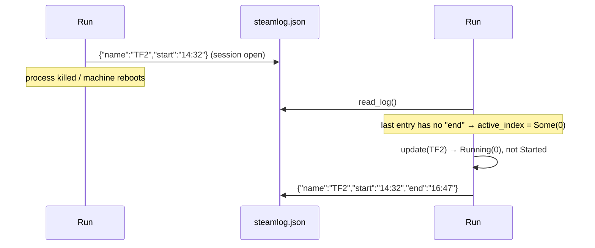

# Session lifecycle

<SourceLink path="src/tracker.rs" lines={259} />

The [`Tracker`](../reference/tracker.mdx) turns a stream of "what is running
right now?" observations into a list of sessions with start and end times. It
holds two pieces of state and nothing else:

```rust
pub struct Tracker {
    log: GameLog,                 // every entry, including historical ones
    active_index: Option<usize>,  // index of the open entry, if any
}
```

## States and transitions

```mermaid
stateDiagram-v2
    direction LR
    [*] --> Idle: Tracker::new(log) with closed or empty log
    [*] --> Active: Tracker::new(log) with last entry end == null (resume)

    Idle --> Active: update(game) → Started(i)<br/>push new entry
    Active --> Active: update(same game) → Running(i)<br/>no mutation
    Active --> Active: update(other game) → Started(j)<br/>close i, push j
    Active --> Idle: end_active() → Ended<br/>stamp end on i
    Idle --> Idle: end_active() → Idle<br/>no-op
```

Each poll calls exactly one of `update` (a game is running) or `end_active`
(nothing is running), and gets back a [`SessionEvent`](../reference/tracker.mdx#sessionevent):

| Event | Meaning | Log mutation |
| --- | --- | --- |
| `Started(i)` | A new session began at index `i` | New entry pushed with `start = now`, `end` absent |
| `Running(i)` | The same game is still running | None |
| `Ended` | The open session was closed | `end = now` on the active entry |
| `Idle` | Nothing was running before or after | None |

:::note The binary ignores the return value
`main` discards the `SessionEvent` (`let _event = …`); the enum exists so that
the state machine is observable and unit-testable, and so library users can
react to transitions. See [Library usage](../guides/library-usage.mdx).
:::

## Switching games

When a poll reports a different game, both operations happen in the same tick
with the **same timestamp**:

```rust
t.update(&game("Dota 2"), "T0");   // Started(0)
t.update(&game("CS2"),    "T1");   // Started(1): entry 0 gains end = "T1"
```

```json
{"games": [
  {"name": "Dota 2", "start": "T0", "end": "T1"},
  {"name": "CS2",    "start": "T1"}
]}
```

Sessions therefore never overlap and never leave gaps between a switch — the
old `end` and the new `start` are the same instant.

:::warning Identity is the game *name*, not the AppID
`update` compares `self.log.games[index].name == game.name`. Two different
games that report the same title would be treated as one continuous session,
and a game that changes its reported title mid-session (rare, but possible
with `gameextrainfo`) would be recorded as a switch. The AppID is available on
`CurrentGame` but is not used for identity.
:::

## Resuming after a restart

`Tracker::new` inspects the log it is given:

```rust
let active_index = log.games.last().and_then(|last| match last.end {
    Some(_) => None,                       // last session finished → idle
    None    => log.games.len().checked_sub(1), // still open → resume it
});
```

That single rule gives SteamLogger crash tolerance for free:



Consequences to be aware of:

- **Only the last entry** is considered. Historical entries missing `end`
  (hand-edited files) are never repaired.
- **The resumed name is not checked** against what is running now. If you quit
  SteamLogger during TF2 and restart it while playing CS2, the first poll sees
  a different name and performs a *switch*: the TF2 entry is closed with the
  current timestamp (inflating its duration by the downtime) and CS2 starts
  fresh.
- **Downtime is invisible.** A session that spans a 6-hour outage looks like
  one 6-hour session. If precision matters, run under a supervisor that
  restarts quickly ([Running continuously](../getting-started/running-continuously.mdx)).

## Attaching enrichment

`apply_meta(index, map, server, friends_playing, friends_in_lobby)` overwrites
the four optional fields of one entry, with one normalisation rule: **empty
slices become `None`**, so an empty list never shows up in the JSON.

```rust
entry.map = map.map(str::to_string);
entry.server = server.map(str::to_string);
entry.friends_playing = (!friends_playing.is_empty()).then(|| friends_playing.to_vec());
entry.friends_in_lobby = (!friends_in_lobby.is_empty()).then(|| friends_in_lobby.to_vec());
```

Because every tick calls it with freshly computed values, the fields always
describe the **latest** observation rather than a union over the session. A
tick where enrichment failed clears them; the next successful tick restores
them.

`apply_meta` is the only tracker method that can fail, and only for an
out-of-bounds index (`entry index N out of bounds`). `main` guards against
that by passing `tracker.active_index()`.

## Worked example: a full evening

| Tick | Steam reports | Call | Event | Log after the tick |
| --- | --- | --- | --- | --- |
| 1 | nothing | `end_active("T1")` | `Idle` | `[]` |
| 2 | TF2 | `update(TF2, "T2")` | `Started(0)` | `[TF2 T2–]` |
| 3 | TF2 | `update(TF2, "T3")` | `Running(0)` | `[TF2 T2–]` |
| 4 | CS2 | `update(CS2, "T4")` | `Started(1)` | `[TF2 T2–T4, CS2 T4–]` |
| 5 | nothing | `end_active("T5")` | `Ended` | `[TF2 T2–T4, CS2 T4–T5]` |
| 6 | nothing | `end_active("T6")` | `Idle` | unchanged |

Tick 6 shows the idempotence of `end_active`: closing an already-closed log is
a no-op, and `close_at` additionally refuses to overwrite an existing `end`.

## Tested behaviour

The state machine has ten unit tests plus two integration tests, one per
transition and edge case: `empty_tracker_starts_idle`, `start`, `running`,
`switch`, `end`, `resume`, `closed_last_entry_not_resumed`, `apply_meta`,
`apply_meta_out_of_bounds`, `into_log_returns_underlying`, plus
`tracker_end_to_end` and `tracker_resume_closes_open_session`. See the
[test inventory](../contributing/testing.mdx#tracker-tests).
