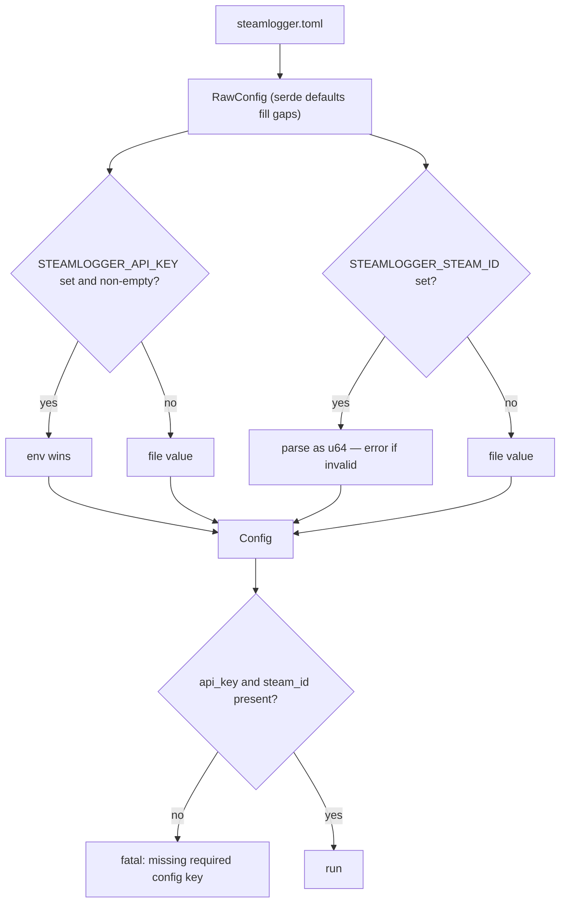

# Configuration reference

<SourceLink path="src/config.rs" lines={263} /> <SourceLink path="steamlogger.example.toml" />

SteamLogger reads exactly one TOML file. Its path is the **first command-line
argument**, defaulting to `steamlogger.toml` in the current working directory.

```bash
steamlogger                       # ./steamlogger.toml
steamlogger /etc/steamlogger.toml # explicit path
```

The file must exist, even if every value comes from the environment. A missing
file is a fatal error (exit code `1`).

## Keys

| Key | Type | Required | Default | Description |
| --- | --- | --- | --- | --- |
| `api_key` | string | **yes** | — | [Steam Web API key](https://steamcommunity.com/dev/apikey). Overridable with `STEAMLOGGER_API_KEY`. |
| `steam_id` | integer (unsigned 64-bit) | **yes** | — | SteamID64 of the tracked account, unquoted. Overridable with `STEAMLOGGER_STEAM_ID`. |
| `poll_interval_secs` | integer (unsigned 64-bit) | no | `30` | Seconds between polls. Effective minimum is `5` — smaller values are clamped at runtime. |
| `output_file` | string (path) | no | `"steamlog.json"` | Where the JSON log is written. Relative paths resolve against the working directory. |
| `enrich` | boolean | no | `true` | Collect friends / lobby / server+map data. `false` logs only name, start and end. |

Unknown keys are **ignored**, not rejected — a typo like `poll_intervals_secs`
silently leaves the default in place. Grep your config against the table above
if a setting seems to have no effect.

### The complete example file

This is `steamlogger.example.toml`, reproduced verbatim (the same text is
available programmatically from [`config::example_config()`](./reference/config.mdx#example_config)):

```toml title="steamlogger.example.toml"
# SteamLogger example configuration.
# Copy this file to `steamlogger.toml` next to the binary and edit the values.

# Steam Web API key. Required.
# Get one at https://steamcommunity.com/dev/apikey
# May be overridden by the STEAMLOGGER_API_KEY environment variable.
api_key = "YOUR_STEAM_API_KEY"

# Numeric SteamID64 of the tracked user. Required.
# Find yours at https://steamid.io or in your Steam profile URL's vanity lookup.
# May be overridden by the STEAMLOGGER_STEAM_ID environment variable.
steam_id = 76561198000000000

# Seconds between polls of the Steam API. Optional, defaults to 30.
poll_interval_secs = 30

# Path of the JSON log file written by the app. Optional, defaults to "steamlog.json".
output_file = "steamlog.json"

# Whether to collect friends/lobby/map enrichment data. Optional, defaults to true.
enrich = true
```

## Environment variables

| Variable | Overrides | Behaviour |
| --- | --- | --- |
| `STEAMLOGGER_API_KEY` | `api_key` | Used when set **and non-empty**. An empty value falls back to the file. |
| `STEAMLOGGER_STEAM_ID` | `steam_id` | Used when set **at all**. Must parse as an unsigned 64-bit integer (surrounding whitespace is trimmed) — otherwise startup fails. |

The two variables behave slightly differently on purpose, and the asymmetry is
worth remembering:

```bash
STEAMLOGGER_API_KEY="" steamlogger     # ok: falls back to api_key in the file
STEAMLOGGER_STEAM_ID="" steamlogger    # error: "" is not a valid u64
```

## Precedence



In short: **environment beats file, file beats default**, and the two required
keys must be resolved from *somewhere*.

## Validation and error messages

[`config::load`](./reference/config.mdx#load) fails fast with a contextual
message; `main` prints it to stderr together with a hint and exits with code
`1`.

| Situation | Message (abridged) |
| --- | --- |
| Path does not exist or is a directory | `config file not found: <path> (see steamlogger.example.toml for a commented example)` |
| File unreadable (permissions) | `failed to read config file <path>` |
| Not valid TOML | `invalid TOML in config file <path>` |
| `STEAMLOGGER_STEAM_ID` not a number | `STEAMLOGGER_STEAM_ID must be a valid u64` |
| No `api_key` anywhere | ``missing required config key `api_key` (set it in steamlogger.toml or via STEAMLOGGER_API_KEY)`` |
| No `steam_id` anywhere | ``missing required config key `steam_id` (set it in steamlogger.toml or via STEAMLOGGER_STEAM_ID)`` |

Anything that is *not* a config problem — a failing poll, an unreachable game
server, a log write error — is reported on stderr and the loop keeps running.
See [Resilience](./architecture/resilience.mdx).

## Worked examples

### Minimal file, secrets from the environment

```toml title="steamlogger.toml"
poll_interval_secs = 15
output_file = "/var/lib/steamlogger/steamlog.json"
```

```bash
export STEAMLOGGER_API_KEY=xxxxxxxxxxxxxxxxxxxxxxxxxxxxxxxx
export STEAMLOGGER_STEAM_ID=76561198000000000
steamlogger /etc/steamlogger/config.toml
```

### Lightweight mode (no enrichment)

Only one Steam API call per tick, no UDP traffic, and the log keeps just
`name`, `start` and `end`:

```toml title="steamlogger.toml"
api_key = "xxxxxxxxxxxxxxxxxxxxxxxxxxxxxxxx"
steam_id = 76561198000000000
enrich = false
```

### Several accounts on one machine

Run one process per account, each with its own config and output file:

```toml title="alice.toml"
api_key = "xxxxxxxxxxxxxxxxxxxxxxxxxxxxxxxx"
steam_id = 76561198000000001
output_file = "/var/lib/steamlogger/alice.json"
```

```bash
steamlogger /etc/steamlogger/alice.toml &
steamlogger /etc/steamlogger/bob.toml &
```

Never point two processes at the same `output_file`: both rewrite the whole
file every tick and the last writer wins.

## Choosing `output_file`

- **Absolute paths are the safe choice** for anything run by a service
  manager, where the working directory is not what you expect.
- Parent directories are created automatically on the first write.
- A bare filename (`steamlog.json`) or an absolute path both work in all
  cases. A *relative path containing a directory* (`logs/steamlog.json`) hits
  a known edge case in the atomic-write helper — see
  [`storage::write_log` → Known edge case](./reference/storage.mdx#known-edge-case-relative-paths-with-a-parent-directory).

:::warning Protect the file
`steamlogger.toml` contains a credential. On Unix:

```bash
chmod 600 steamlogger.toml
```

Both `steamlogger.toml` and `steamlog.json` are already in the repository
`.gitignore`.
:::

## Related

- [`steamlogger::config` API reference](./reference/config.mdx) — the types and
  functions behind this page.
- [Running continuously](./getting-started/running-continuously.mdx) — passing
  config paths from systemd, launchd and Task Scheduler.
- [Log format](./output-format.mdx) — what ends up in `output_file`.
