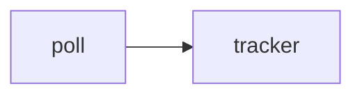

# Documentation workflow

This site lives in `website/` inside the SteamLogger repository and is built
with [Docusaurus 3](https://docusaurus.io/).

## Run it locally

```bash
cd website
npm install          # once
npm start            # dev server with hot reload on http://localhost:3000
```

```bash
npm run build        # production build into website/build
npm run serve        # serve the production build locally
npm run check:api    # verify every public Rust item is documented
npm run check        # check:api + build — what CI runs
npm run clear        # wipe the Docusaurus cache if something looks stale
```

Node 20+ is required (`engines` in `package.json`).

## Layout

```text
website/
├── docusaurus.config.js   site config: URL, navbar, footer, Mermaid, search
├── sidebars.js            hand-written sidebar = intended reading order
├── scripts/
│   └── check-api-coverage.mjs   docs/code drift guard
├── src/
│   ├── components/        homepage cards, <SourceLink />
│   ├── css/custom.css     Steam-inspired palette, reference-page styles
│   ├── pages/index.js     landing page
│   └── theme/MDXComponents.js   registers <SourceLink /> globally
├── static/img/            logo, favicon, social card
└── docs/
    ├── intro.mdx
    ├── configuration.mdx
    ├── output-format.mdx
    ├── troubleshooting.mdx
    ├── getting-started/   installation · quickstart · running continuously
    ├── architecture/      overview · poll loop · lifecycle · enrichment · resilience
    ├── reference/         one page per module + the API index
    ├── guides/            jq recipes · library usage
    └── contributing/      development · testing · this page
```

Every page is `.mdx` so that JSX components work anywhere.

## Writing conventions

### Page frontmatter

```yaml
---
id: tracker                      # stable id used by sidebars.js
title: steamlogger::tracker      # <h1> and browser title
sidebar_label: tracker           # short label in the sidebar
sidebar_position: 4              # order within the category
description: ...                 # meta description, shown in search results
---
```

### Linking

Use **relative links including the file extension** — Docusaurus resolves and
validates them at build time, and `onBrokenLinks: 'throw'` turns a typo into a
failed build:

```md
[`Tracker::update`](../reference/tracker.mdx#update)
[Log format](../output-format.mdx)
```

### Source badges

Reference pages open with a link to the file they document. `<SourceLink />`
is registered globally in `src/theme/MDXComponents.js`, so no import is
needed:

```mdx
<SourceLink path="src/tracker.rs" lines={259} />
```

### Headings and anchors

Give every API heading an explicit anchor so links survive renames:

```md
### `Tracker::apply_meta` {/* #apply_meta */}
```

### Code blocks

Rust, TOML, JSON, Bash, INI and diff highlighting are enabled. Add a title
when the snippet is a file:

````md
```rust title="src/tracker.rs"
pub fn update(&mut self, game: &CurrentGame, now: &str) -> SessionEvent
```
````

Signatures must be **copied verbatim** from the source, including `&mut self`
and lifetimes.

### Diagrams

Mermaid is enabled (`@docusaurus/theme-mermaid`). Avoid raw `<` and `>` inside
node labels — they are parsed as HTML. Write `Option of CurrentGame`, not the
generic form:

````md

````

### Admonitions

`:::note`, `:::tip`, `:::info`, `:::caution`, `:::warning`, `:::danger`. Use
`:::danger` for anything that can lose user data (overwriting a corrupt log,
panics) and `:::warning` for behaviour that surprises people (session identity
by name, private profiles).

## API coverage check {/* #api-coverage-check */}

`scripts/check-api-coverage.mjs` scans `src/**/*.rs` for public items —
`pub struct`, `pub enum`, `pub fn`, `pub mod` — and asserts that each name
appears in `docs/reference/`. It is the guard against documentation drift:

```bash
npm run check:api
```

```text
✔ 44 public items found in src/
✔ all public items are documented in docs/reference/
```

A missing item fails with a list:

```text
✘ 2 public items are not documented in docs/reference/:
   - src/tracker.rs:  Tracker::pause
   - src/a2s.rs:      ServerInfo::players
Add them to the matching page under website/docs/reference/.
```

The script is intentionally simple (regex, no Rust parsing) and ignores
`#[cfg(test)]` blocks, private items and the `tests/` directory. Run it after
touching any `pub` item.

## Deployment

`.github/workflows/docs.yml` builds the site on every push to `main` that
touches `website/`, `src/`, or the workflow itself, and publishes it to GitHub
Pages. Pull requests get a build-only run (no deploy), so a broken link or a
missing API entry fails the PR.

To publish manually:

```bash
cd website
GIT_USER=<your-github-username> npm run deploy
```

The production URL is configured in `docusaurus.config.js`:

```js
url: 'https://havaianasdestruido.github.io',
baseUrl: '/steamlogger/',
```

Change both if the site moves to a custom domain, and add a `static/CNAME`
file.

## Search

Search is provided by
[`@easyops-cn/docusaurus-search-local`](https://github.com/easyops-cn/docusaurus-search-local):
the index is generated at build time and shipped with the site, so there is no
Algolia account, no crawler and no runtime dependency. It only appears in
production builds — `npm start` shows no search box, which is expected.

## When code changes, update

| Change | Also update |
| --- | --- |
| A `pub` item added/renamed/removed | The module page in `docs/reference/`, the index table, then `npm run check:api` |
| A config key | [Configuration](../configuration.mdx) and [`config`](../reference/config.mdx) |
| A JSON field | [Log format](../output-format.mdx), [`model`](../reference/model.mdx), the homepage sample |
| Error messages | [Resilience](../architecture/resilience.mdx#reading-the-diagnostics) and [Troubleshooting](../troubleshooting.mdx) |
| A new test | The counts and tables in [Testing](./testing.mdx) |
| Behaviour of a tick | [The poll loop](../architecture/poll-loop.mdx) |
