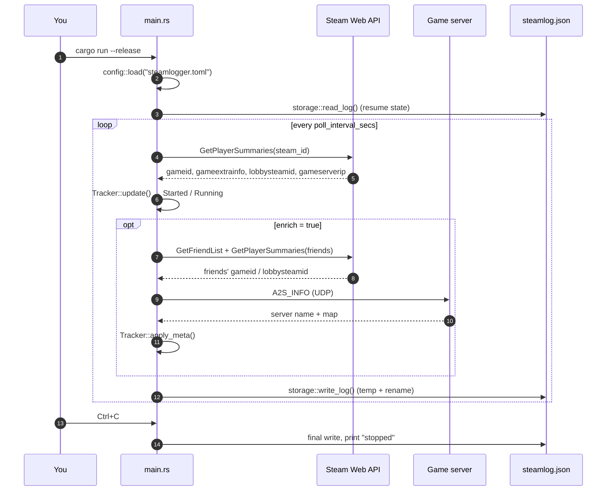

# Quickstart

This page takes you from a built checkout to a first recorded session.

## 1. Create the config file

```bash
cp steamlogger.example.toml steamlogger.toml
```

Open `steamlogger.toml` and fill in the two required keys:

```toml title="steamlogger.toml"
api_key = "YOUR_STEAM_API_KEY"   # required
steam_id = 76561198000000000     # required, numeric SteamID64 (no quotes)

poll_interval_secs = 30          # optional, default 30 (values below 5 are clamped to 5)
output_file = "steamlog.json"    # optional, default "steamlog.json"
enrich = true                    # optional, default true
```

Prefer not to put secrets in a file? Both required keys can come from the
environment instead:

```bash
export STEAMLOGGER_API_KEY=xxxxxxxxxxxxxxxxxxxxxxxxxxxxxxxx
export STEAMLOGGER_STEAM_ID=76561198000000000
```

The file must still exist — it may contain only optional keys, or nothing at
all. Full rules in the [configuration reference](../configuration.mdx).

## 2. Run it

```bash
cargo run --release
```

```text
SteamLogger running. Log file: steamlog.json  (Ctrl+C to stop)
```

By default the config is read from `steamlogger.toml` in the current working
directory. Pass a path to override it:

```bash
cargo run --release -- /etc/steamlogger/config.toml
# or, with an installed binary:
steamlogger ~/.config/steamlogger/config.toml
```

## 3. Launch a game

Start any game from Steam and wait one poll interval. The log file appears next
to the binary (or wherever `output_file` points) with the session already open:

```json title="steamlog.json — session in progress"
{
  "games": [
    {
      "name": "Team Fortress 2",
      "start": "2026-08-10T14:32:15-03:00",
      "map": "cp_dustbowl",
      "server": "Team Fortress 2 #42",
      "friends_playing": ["medicmain99"],
      "friends_in_lobby": ["medicmain99"]
    }
  ]
}
```

While a session is open there is **no `end` field** — optional fields are
omitted rather than written as `null`. When you quit the game, the next poll
closes the entry:

```json title="steamlog.json — session closed"
{
  "games": [
    {
      "name": "Team Fortress 2",
      "start": "2026-08-10T14:32:15-03:00",
      "end": "2026-08-10T16:47:03-03:00",
      "map": "cp_dustbowl",
      "server": "Team Fortress 2 #42",
      "friends_playing": ["medicmain99"],
      "friends_in_lobby": ["medicmain99"]
    }
  ]
}
```

Every field is explained in the [log format reference](../output-format.mdx).

## 4. Stop it

Press <kbd>Ctrl</kbd>+<kbd>C</kbd>. The handler interrupts the sleep
immediately, the log is written one last time, and the process prints
`stopped` and exits with status `0`.

:::info A session open at shutdown stays open
Stopping SteamLogger does **not** close the current entry — `end` stays absent
on purpose. On the next start the tracker sees the open entry and resumes it
instead of creating a duplicate. See
[Session lifecycle → Resume](../architecture/session-lifecycle.mdx#resuming-after-a-restart).
:::

## What just happened



## Next steps

- [Running continuously](./running-continuously.mdx) — keep it alive across
  reboots.
- [Querying the log](../guides/querying-the-log.mdx) — `jq` recipes for
  playtime totals and per-friend stats.
- [Troubleshooting](../troubleshooting.mdx) — empty logs, missing enrichment,
  rate limits.
