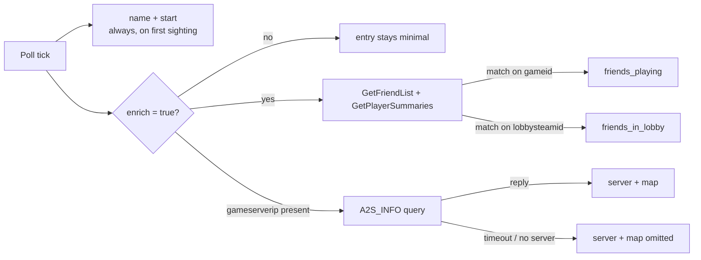

# Log file format

<SourceLink path="src/model.rs" lines={40} /> <SourceLink path="src/storage.rs" lines={210} />

The entire output of SteamLogger is one JSON file (`steamlog.json` by default).
It is rewritten in full on every poll and on exit, pretty-printed with two-space
indentation and a trailing newline.

## Shape

```json title="steamlog.json"
{
  "games": [
    {
      "name": "Team Fortress 2",
      "start": "2026-08-10T14:32:15-03:00",
      "end": "2026-08-10T16:47:03-03:00",
      "map": "cp_dustbowl",
      "server": "vanilla.steamlogger.dev:27015",
      "friends_playing": ["medicmain99"],
      "friends_in_lobby": ["medicmain99"]
    },
    {
      "name": "Counter-Strike 2",
      "start": "2026-08-10T17:01:22-03:00"
    }
  ]
}
```

The root object has exactly one key, `games`, holding entries in the order
sessions started. The second entry above is a session that is still running (or
was running when the process stopped): optional fields are **omitted**, never
`null`.

## Fields

| Field | JSON type | Always present | Meaning |
| --- | --- | --- | --- |
| `name` | string | ✅ | Game title from `gameextrainfo`, or `"App <app_id>"` when Steam does not report a title. |
| `start` | string (RFC 3339) | ✅ | Local time of the first poll that observed the game. |
| `end` | string (RFC 3339) | — | Local time of the poll that observed the game stopped (or that observed a *different* game). Absent while running. |
| `map` | string | — | Current map from the A2S_INFO reply, e.g. `cp_dustbowl`. |
| `server` | string | — | Server name from the A2S_INFO reply, e.g. `Team Fortress 2 #42`. |
| `friends_playing` | array of strings | — | Persona names of friends whose `gameid` matches yours. Sorted, de-duplicated. Omitted when empty. |
| `friends_in_lobby` | array of strings | — | Persona names of friends whose `lobbysteamid` matches yours. Sorted, de-duplicated. Omitted when empty. |

Only `name` and `start` are guaranteed. A minimal entry is therefore:

```json
{"name": "Half-Life", "start": "2026-08-01T10:00:00-03:00"}
```

:::note Why fields disappear instead of being `null`
Every optional field carries `#[serde(skip_serializing_if = "Option::is_none")]`,
so the base format stays small and stable for consumers that only care about
`name`/`start`/`end`. See [`model::LogEntry`](./reference/model.mdx#logentry).
:::

## Timestamps

Timestamps are produced by
[`main::now()`](./reference/main.mdx#now):

```rust
chrono::Local::now().to_rfc3339_opts(chrono::SecondsFormat::Secs, false)
```

- **Local time with an explicit UTC offset** — `2026-08-10T14:32:15-03:00`.
- **Second precision**, no fractional seconds.
- `false` keeps the `+00:00` style offset for UTC rather than printing `Z`.

Consequences worth knowing:

- Entries written in different timezones (travelling laptop, DST change) have
  different offsets; always parse with an offset-aware parser rather than
  slicing the string.
- The resolution of `start`/`end` is the poll interval, not the real event —
  a 30-second interval means edges can be up to 30 seconds late.
- The log is not re-sorted. If the system clock jumps backwards, entries stay
  in insertion order.

## When each field is filled



Enrichment fields are **recomputed on every tick while the session is open**,
and they always reflect the most recent successful observation. A friend who
joins halfway through appears from then on; a failed enrichment pass clears the
fields back to absent for that write, and the next successful pass restores
them. Historical per-minute detail is not kept — the log stores the last state,
not a timeline.

## Why entries end

An entry is closed (gains `end`) in exactly two situations, both handled by
[`Tracker`](./reference/tracker.mdx):

1. A poll reports **no game running** → `end_active()` stamps `end`.
2. A poll reports a **different game** → the old entry is closed with the same
   timestamp used as the new entry's `start`, so sessions never overlap.

Quitting SteamLogger while a game runs leaves the entry open on purpose; the
next run resumes it. See
[Session lifecycle](./architecture/session-lifecycle.mdx).

## Accepted input formats

[`storage::read_log`](./reference/storage.mdx#read_log) is more tolerant than
the writer, which matters when you hand-edit or migrate a file:

| File content | Result |
| --- | --- |
| Missing file | Empty log (`{"games": []}`) |
| `{"games": [...]}` | Parsed as-is |
| `[ ... ]` (bare array of entries) | Normalised into `{"games": [...]}` |
| Anything else / invalid JSON | Error — and at startup `main` turns that error into an **empty log**, so the file is overwritten on the next tick |

:::danger Back up before hand-editing
If your edit makes the file unparseable, the next startup silently starts from
an empty log and the first write replaces your history. Copy the file first,
and validate with `jq . steamlog.json` before restarting.
:::

## Durability

Writes go through a temp file next to the target, followed by a rename:

```text
steamlog.json.tmp   ← full JSON written here
        ↓ rename(2)
steamlog.json       ← replaced atomically
```

A crash mid-write therefore leaves either the previous complete file or the new
complete file — never a truncated one. Details and the one caveat around
`fsync` are in
[`storage::write_log`](./reference/storage.mdx#write_log) and
[Resilience](./architecture/resilience.mdx#atomic-writes).

## Consuming the log

A sample file lives at
[`tests/fixtures/steamlog_sample.json`](https://github.com/havaianasdestruido/steamlogger/blob/main/tests/fixtures/steamlog_sample.json)
and is parsed by the integration test `steamlog_sample_fixture_parses`, so it
always matches the current schema. Use it as a stable example payload when
writing a dashboard, importer or exporter.

Ready-made `jq` queries — total playtime, sessions per game, most frequent
teammates — are in [Querying the log](./guides/querying-the-log.mdx).
